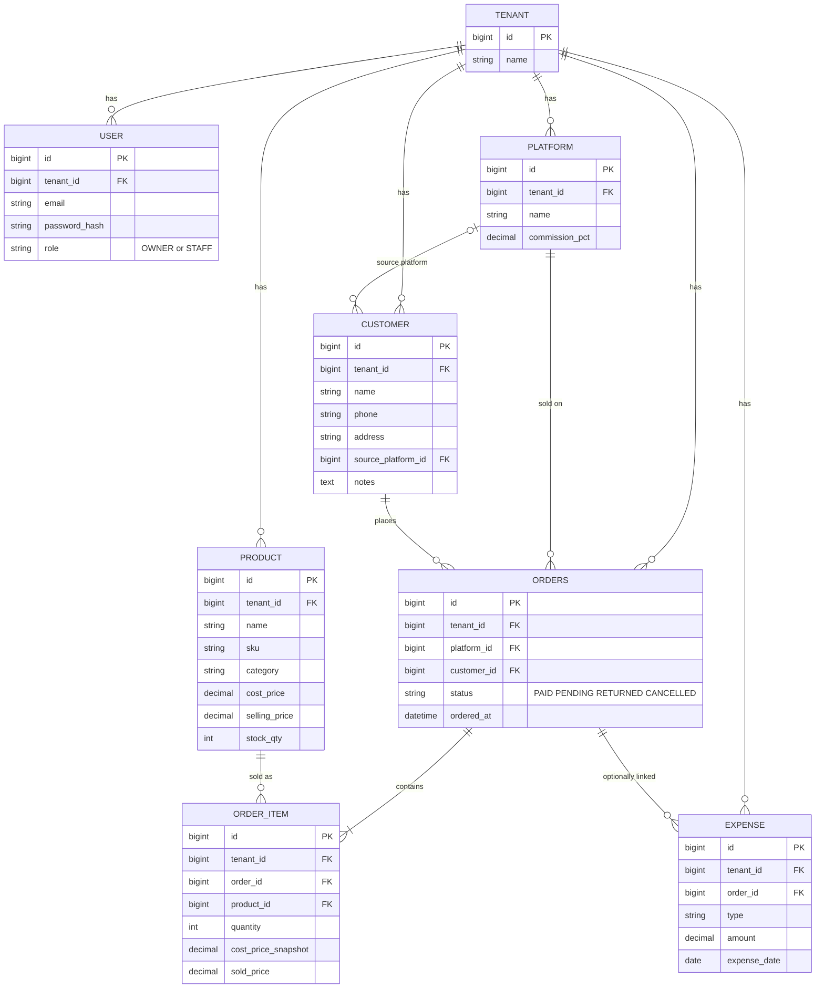

# ER Diagram (Phase 1)

Every table carries `tenant_id` (`tenants.id` is the tenant identity itself). Order items snapshot cost and sold price at sale time.

```mermaid
erDiagram
    TENANT ||--o{ USER : has
    TENANT ||--o{ PLATFORM : has
    TENANT ||--o{ PRODUCT : has
    TENANT ||--o{ CUSTOMER : has
    TENANT ||--o{ ORDERS : has
    TENANT ||--o{ EXPENSE : has
    PLATFORM ||--o{ ORDERS : "sold on"
    CUSTOMER ||--o{ ORDERS : places
    ORDERS ||--|{ ORDER_ITEM : contains
    PRODUCT ||--o{ ORDER_ITEM : "sold as"
    ORDERS ||--o{ EXPENSE : "optionally linked"
    PLATFORM |o--o{ CUSTOMER : "source platform"

    TENANT { bigint id PK
             string name }
    USER { bigint id PK
           bigint tenant_id FK
           string email
           string password_hash
           string role "OWNER or STAFF" }
    PLATFORM { bigint id PK
               bigint tenant_id FK
               string name
               decimal commission_pct }
    PRODUCT { bigint id PK
              bigint tenant_id FK
              string name
              string sku
              string category
              decimal cost_price
              decimal selling_price
              int stock_qty }
    CUSTOMER { bigint id PK
               bigint tenant_id FK
               string name
               string phone
               string address
               bigint source_platform_id FK
               text notes }
    ORDERS { bigint id PK
             bigint tenant_id FK
             bigint platform_id FK
             bigint customer_id FK
             string status "PAID PENDING RETURNED CANCELLED"
             datetime ordered_at }
    ORDER_ITEM { bigint id PK
                 bigint tenant_id FK
                 bigint order_id FK
                 bigint product_id FK
                 int quantity
                 decimal cost_price_snapshot
                 decimal sold_price }
    EXPENSE { bigint id PK
              bigint tenant_id FK
              bigint order_id FK
              string type
              decimal amount
              date expense_date }
```
